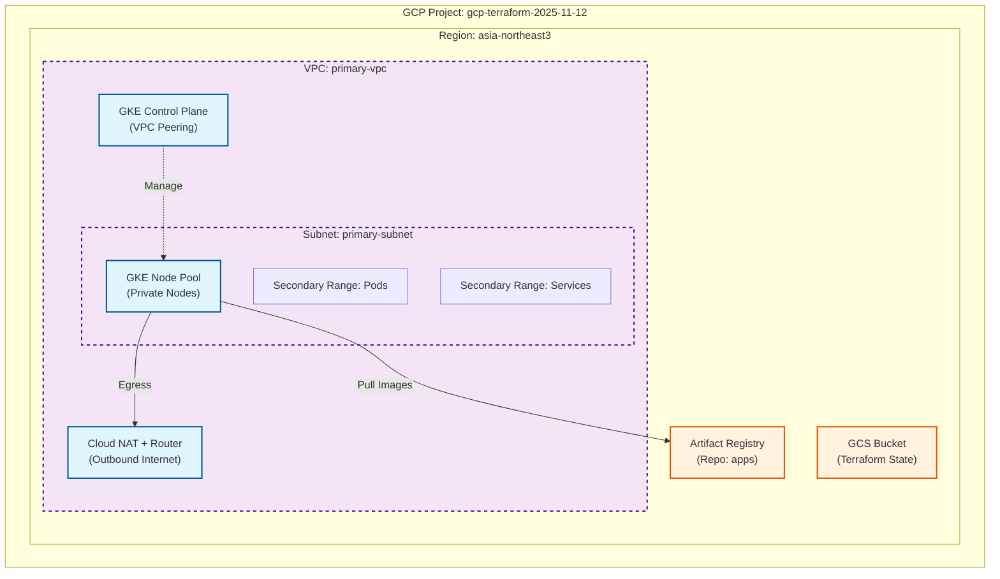

# GCP Infrastructure Architecture

This document describes the high-level architecture of the GCP infrastructure provisioned by this Terraform project.

## Overview

The infrastructure is designed to support a secure, scalable GKE environment. Key components include:

-   **Network**: A custom VPC with private subnets and secondary IP ranges for GKE Pods and Services.
-   **Security**: Private GKE cluster with no public endpoints for nodes. Outbound internet access is provided via Cloud NAT.
-   **Compute**: GKE Standard cluster with managed node pools.
-   **Storage**: Artifact Registry for container images and GCS for Terraform state.

## Architecture Diagram

## Component Details

### 1. Networking (`modules/network`, `modules/nat`)
-   **VPC**: `primary-vpc`
-   **Subnet**: `primary-subnet` (Default: `10.10.0.0/24`)
    -   **Pods Range**: `10.20.0.0/16`
    -   **Services Range**: `10.30.0.0/20`
-   **Cloud NAT**: Enables private nodes to access the internet (e.g., for downloading updates or external images) without exposing public IPs.

### 2. Kubernetes Engine (`modules/gke`)
-   **Cluster Name**: `gke-primary`
-   **Type**: Standard Private Cluster
-   **Features**:
    -   **IP Aliasing**: Uses VPC secondary ranges for Pods.
    -   **Workload Identity**: Securely map KSA (Kubernetes Service Accounts) to GSA (Google Service Accounts).
    -   **Managed Prometheus**: Integrated monitoring.
    -   **Private Nodes**: Nodes have only internal IPs.

### 3. Storage & Artifacts (`modules/artifact_registry`)
-   **Artifact Registry**: Docker repository named `apps` for storing container images.
-   **GCS Bucket**: Used as a backend to store Terraform state files securely.

## Security Posture
-   **Identity**: IAM roles are assigned to a dedicated Terraform Service Account (`tf-automation`).
-   **Network**: No public access to nodes. Control plane access is restricted.

---

# GCP 인프라 아키텍처 (Korean)

이 문서는 이 Terraform 프로젝트를 통해 프로비저닝되는 GCP 인프라의 상위 레벨 아키텍처를 설명합니다.

## 개요

이 인프라는 안전하고 확장 가능한 GKE 환경을 지원하도록 설계되었습니다. 주요 구성 요소는 다음과 같습니다.

-   **네트워크 (Network)**: GKE Pod 및 Service를 위한 보조 IP 범위(Secondary IP ranges)가 포함된 커스텀 VPC 및 프라이빗 서브넷.
-   **보안 (Security)**: 노드에 대한 퍼블릭 엔드포인트가 없는 프라이빗 GKE 클러스터. 아웃바운드 인터넷 접근은 Cloud NAT를 통해 제공됩니다.
-   **컴퓨팅 (Compute)**: 관리형 노드 풀(Managed Node Pools)을 사용하는 GKE Standard 클러스터.
-   **스토리지 (Storage)**: 컨테이너 이미지를 위한 Artifact Registry 및 Terraform 상태 저장을 위한 GCS.

## 아키텍처 다이어그램

(위의 Mermaid 다이어그램을 참조하세요)

## 구성 요소 상세

### 1. 네트워킹 (`modules/network`, `modules/nat`)
-   **VPC**: `primary-vpc`
-   **서브넷**: `primary-subnet` (기본값: `10.10.0.0/24`)
    -   **Pods 범위**: `10.20.0.0/16`
    -   **Services 범위**: `10.30.0.0/20`
-   **Cloud NAT**: 프라이빗 노드가 퍼블릭 IP 노출 없이 인터넷에 접근(예: 업데이트 다운로드, 외부 이미지 풀링)할 수 있도록 지원합니다.

### 2. Kubernetes Engine (`modules/gke`)
-   **클러스터 이름**: `gke-primary`
-   **유형**: Standard Private Cluster
-   **주요 기능**:
    -   **IP Aliasing**: Pod에 VPC 보조 범위 사용.
    -   **Workload Identity**: KSA(Kubernetes Service Accounts)를 GSA(Google Service Accounts)에 안전하게 매핑.
    -   **Managed Prometheus**: 통합 모니터링.
    -   **Private Nodes**: 노드는 내부 IP만 가짐.

### 3. 스토리지 및 아티팩트 (`modules/artifact_registry`)
-   **Artifact Registry**: 컨테이너 이미지를 저장하기 위한 Docker 리포지토리 (`apps`).
-   **GCS Bucket**: Terraform 상태 파일을 안전하게 저장하기 위한 백엔드로 사용.

## 보안 태세 (Security Posture)
-   **계정 (Identity)**: 전용 Terraform 서비스 계정(`tf-automation`)에 IAM 역할 부여.
-   **네트워크 (Network)**: 노드에 대한 퍼블릭 액세스 차단. 제어 평면(Control Plane) 액세스 제한.
